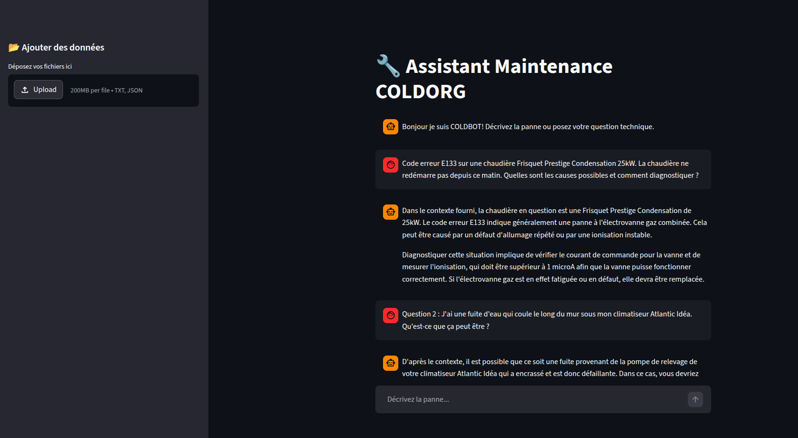

<a id="readme-top"></a>

<div align="center">
  <br />
      
  <br />

  <div>
  
  
  
  
  
  
  
</div>

  <h3 align="center">Assistant IA Techniciens de Maintenance — COLDBOT</h3>

   <div align="center">
     Prototype d'assistant RAG (Retrieval-Augmented Generation) pour aider les techniciens de maintenance à diagnostiquer des pannes en s'appuyant sur l'historique des interventions et les fiches techniques équipements.
    </div>
</div>
<div>
  ______________________________________________________________________________________________________________________________________________________
</div>

<!-- SOMMAIRE -->
<details>
  <summary>Table de contenu</summary>
  <ol>
    <li>
      <a href="#le-projet">A propos du projet</a>
      <ul>
        <li><a href="#stack-technique">Stack Technique</a></li>
      </ul>
    </li>
    <li>
      <a href="#commencement">Commencer</a>
      <ul>
        <li><a href="#installation">Installation</a></li>
        <li><a href="#lancement">Lancement</a></li>
      </ul>
    </li>
    <li><a href="#resultats-des-test">Resultats des tests</a></li>
    <li><a href="#revue-de-code">Revue de code</a></li>
    <li><a href="#limites-identifiées">Limites identifiées</a></li>
    <li><a href="#piste-d'amélioration">Piste d'amélioration</a></li>
    <li><a href="#contact">Contact</a></li>
    <li><a href="#Outils">Outils</a></li>
  </ol>
</details>

### Installation

1. **Cloner le dépôt :**

```bash
git clone https://github.com/Quentincs50/cold-rag-assistance
```
2. **Installer uv (si ce n'est pas déjà fait**
```bash
curl -LsSf https://astral.sh/uv/install.sh | sh
```

3. **Configurer les variables d'environnements virtuel et installer les dépendances**
```bash
uv venv
source .venv/bin/activate
uv add langchain langchain-community langchain-ollama langchain-chroma chromadb python-dotenv streamlit
```

4. **Installer Ollama et les modèles**
```bash
# Installer Ollama
curl -fsSL https://ollama.com/install.sh | sh

# Télécharger les modèles
ollama pull nomic-embed-text   # modèle d'embeddings (274 MB)
ollama pull mistral             # LLM principal (4.4 GB)
```
<p align="right">(<a href="#readme-top">retour haut de la page</a>)</p>

### Lancement 

1. **Indexation des données**
```bash
# Si vous utilisez python3
python3 setup_database.py 

# Sinon
python setup_database

# Pour réinitialiser la base ChromaDB
python main.py --reset
```

2. **Lancement streamlit**
```bash
streamlit run app.py
```

## Resultats des tests

```bash
cat result_test.txt
```
<p align="right">(<a href="#readme-top">retour haut de la page</a>)</p>

## Revue de code

│   ├── helper.py         | fonction qui gère l'intégration
│   ├── query_data.py     | fonction qui gère la requête utilisateur
│   └── setup_database.py | fonctions les loader des fichiers selon leurs emplacements et leur nature et formate en documents, split les documents en chunks, formate les chunks avec des id uniques, ajoute les chunks intégrés dans la database

## Limites identifiées 

Lenteur en local sur CPU : Mistral 7B nécessite ~5 GB RAM. Sur une machine avec peu de RAM disponible, le modèle swap sur disque. En production : déploiement GPU ou API externe (Groq, OpenAI).

Mémoire de conversation limitée : l'historique Streamlit est en session, pas persistant.

## Pistes d'amélioration 

Si au lieu de 30 interventions il y en a 10 000 il faudrait filtrer par métadonnées, par marque ou code d'erreur avant la recherche. 
```bash
def load_interventions():
    loader = JSONLoader(
    file_path=f"{JSON_PATH}/{JSON_FILE_NAME}",
    jq_schema=".[]", # <--- ici
    text_content=False,
    )
    docs = loader.load()
    return docs
```

## Contact
Quentin Sanchez - [@Quentin_Sanchez](https://www.linkedin.com/in/quentin-sanchez-9b6741b6) - Linkedin
